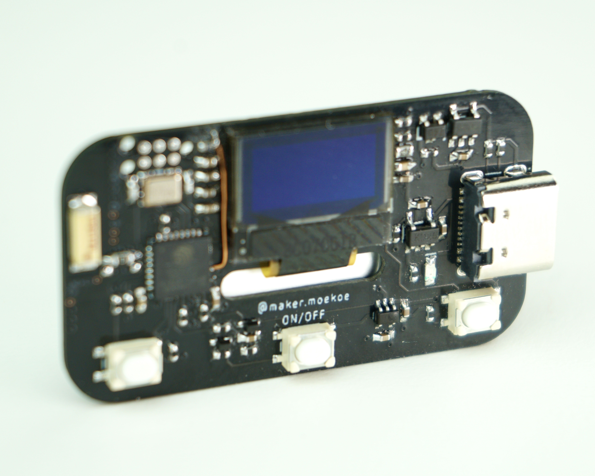

# ESP8285_OLED_REMOTE

(Click on the image for a small video.)

Little WiFi remote based on ESP8285 SoC. Furthermore it contains a LiPo protection + charging circuit, a 3.3volts voltage regulator, a 64x48 pixels OLED display and three buttons.
The power latching circuit ensures that the ESP8285 don't need to be in deep sleep mode while in OFF state. This puts it down to around 3µA during 'sleep', due to the battery protection. It can be woke up only by the middle button. The battery protection occupies reverse voltage protection through the mosfet. Overdischarge voltage of the XB5353A is 2.4volts, which is only for safety reasons. The battery voltage should always be checked with the voltage divider, which gives you an estimation of the battery state.

Main components are:
- ESP8285 QFN32 SoC
- 0.49" 64x48 pixels 14pin OLED display
- XB5353A protection
- SE7401U polarity
- MCP73831 charging
- RT9193 regulator
- AN2051 2.4GHz antenna

Check out the code in the 'code' section. It is used in PlatformIO, but can be shifted to Arduino IDE easily. The code is exactly the same.

When you have questions then feel free to ask.

Have fun! :)
